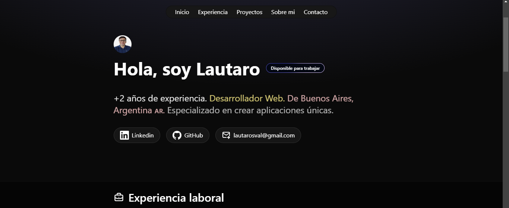

# Lautaro

Este es un proyecto de portafolio web personal construido con Astro, React, HTML, CSS y TailwindCSS. 


## Demo 🚀

👉[Prueba el carrito en vivo aquí]()

## Screenshots




## Main Features ✨

- **Astro:** Utilizo Astro para crear sitios web rápidos y basados ​​en contenido. Astro, que prioriza el servidor, mejora el rendimiento del sitio web  proporcionando una experiencia de desarrollo moderna.
- **React y TypeScript:** Construcción del proyecto con React para una arquitectura basada en componentes y TypeScript para tipado estático, mejorando la capacidad de mantenimiento del código.
- **Tailwind CSS:** uso de Tailwind CSS para lograr un estilo que priorice la utilidad, lo que facilita la creación y el mantenimiento de un sistema de diseño consistente.


## Installation  and use

1. Clona el repositorio:

```bash
  git clone https://github.com/lautaroVal/my-portfolio.git
```
2. Navega al directorio del proyecto:

```bash
  cd my-portfolio
```
3. Instala las dependencias:

```bash
  npm install
```
4. Inicia la aplicación:

```bash
  npm run dev
```

5. Accede a la aplicación:
Abre tu navegador y navega a http://localhost:4321/ para interactuar con la aplicación.